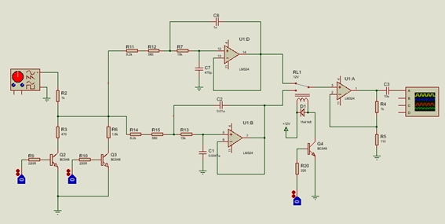
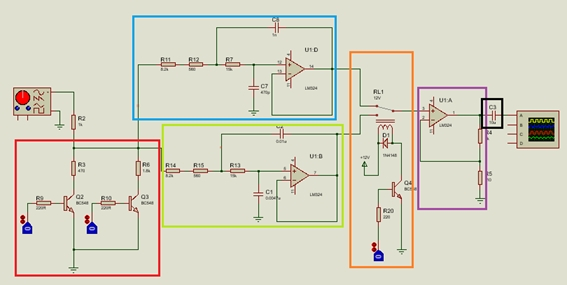

# DDS-generator

This repository contains code and documentation of a DDS generator made
with STM32F407VG discovery board.

# Circuit

The shown before is the circuit design for its functionalities. Requirements were to have two bands with a frequency difference between them of a decade. So, frecuencies selected started in 100Hz and finished
in 10kHz. Also, three voltage levels were required, so 5V, 7V and 10V were used.

## Explanation

Circuit is separated in five parts, to explain each one in detailed.

 - Red box: For controlling voltage level, two transistors stages were used. Each used enables the "Rb" resistors of a classic resistors voltage divisor.

 - Blue box: When using DAC, signals outputs seems digitalized when reconstructed. Due to that, an reconstruction filter is needed. This is a low pass active filter, with fc set a decade over higher frequency of the band. This circuit is the 1kHz to 10kHz band filter.

 - Yellow box: Another reconstruction filter, this for the other decade band, from 100Hz to 1kHz.

 - Orange box: To conmute filter from STM board, a relay and a transistor stage are used.

 - Purple box: An amplifier to reach voltage level desired, and a to separate load from circuit.

 - Black box. DAC outputs always positive values, so a capacitor to filter DC voltage is added.

# About code

To generate signals [TIlen Majerle library](http://stm32f4-discovery.net/2014/09/library-36-dac-signal-generator-stm32f4/) was used. Also, its [LCD control library](http://stm32f4-discovery.net/2014/06/library-16-interfacing-hd44780-lcd-controller-with-stm32f429-discovery/) was needed because a 20x4 display was used.

It shows important information in display, like actual waveform, attenuation level, band selected and actual frequency value.

A potentiometer changes frequency, and a four switches keypad was added to change wave parameters.